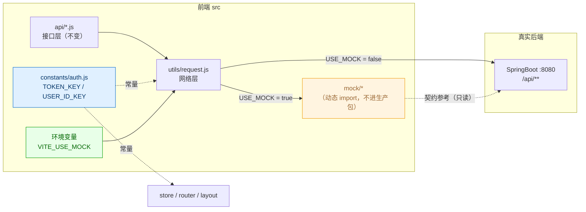
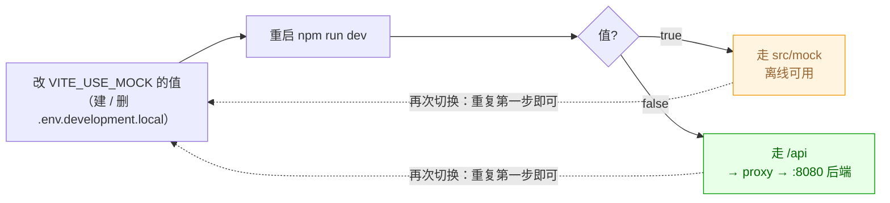

# Mock 改造与后端联调执行清单

> 项目：淘学二手 · 校园二手交易平台（前端）
> 技术栈：Vite 8 + Vue 3 + Element Plus + Pinia + vue-router
> 文档状态：批次 A、B 已执行完毕（Mock 开关已改为环境变量驱动、Mock 已改动态引入）
> 适用范围：团队开始自研后端时，前端由 Mock 切换到真实 `/api` 的完整改造方案
>
> ⚠️ **路径基准**：本仓库为 monorepo，本文档中所有 `src/**` 路径均指 **`frontend/src/**`**（前端已迁入 `frontend/` 目录）；前端命令需在 `frontend/` 目录下执行。

---

## 0. 一句话结论

**不要删除 `src/mock` 目录。**

真正要做的三件事是：

1. **解耦**：把被"寄养"在 Mock 里的公共常量（`TOKEN_KEY` / `USER_ID_KEY`）搬出来，让业务代码不再 `import from '@/mock'`；
2. **加开关**：把 `useMock` 从硬编码改为**环境变量控制**，联调时改配置即可，前端代码零改动；
3. **留底**：`src/mock` 保留在仓库中，继续作为"离线演示兜底 + 后端接口说明书"。

删除 Mock 是**最后一步**，且有明确前置条件（见第 8 节）。

---

## 1. 现状盘点

### 1.1 Mock 的入口与开关

`src/utils/request.js` 是唯一的网络出口，也是唯一的分流开关：

```js
// src/utils/request.js（现状）
import { mockDispatch } from '@/mock/handlers'   // ← 静态引入，改 false 也仍会被打包
import { TOKEN_KEY } from '@/mock'               // ← 常量寄养在 Mock 里

export const USE_MOCK = true                     // ← 硬编码，改开关要动源码

export default function request(config) {
  const finalConfig = { method: 'get', ...config, headers: { ...(config.headers || {}) } }
  if (!USE_MOCK) return service(finalConfig)     // 走 axios → /api → vite proxy → :8080
  return mockDispatch(finalConfig).then(unwrap)  // 走本地 Mock
}
```

### 1.2 耦合地图（关键问题）

`src/mock` 并**不只**服务于 Mock 请求，它还被 4 个业务文件静态引入：

| # | 文件 | 引入内容 | 用途 | 删除后后果 |
|---|------|---------|------|-----------|
| 1 | `src/utils/request.js` | `mockDispatch`、`TOKEN_KEY` | 请求分流 + token key | 编译报错 |
| 2 | `src/store/user.js` | `TOKEN_KEY`、`USER_ID_KEY` | 登录态持久化 | 编译报错 |
| 3 | `src/router/index.js` | `USER_ID_KEY` | 路由守卫鉴权 | 编译报错 |
| 4 | `src/layout/AppLayout.vue` | `USER_ID_KEY` | 登录水合 / 未读轮询 | 编译报错 |

> **结论**：直接删 `src/mock` 会让上述 4 个文件立即编译失败。
> 所以顺序必须是「**先解耦，再谈开关，最后才谈删除**」。

### 1.3 完整文件清单

```
src/
├── api/                      # 接口层（7 个文件，无需改动，保持纯净）
│   ├── auth.js  cart.js  favorite.js  message.js  order.js  product.js  stat.js
├── constants/                # 领域常量（本次新增 auth.js）
│   ├── address.js  message.js  order.js  product.js
├── mock/                     # ★ 改造对象
│   ├── data.js               # 基准数据种子
│   ├── handlers.js           # 路由表（= 接口契约清单）
│   ├── helpers.js            # 统一返回 / 鉴权 / 分页 / 装饰
│   ├── index.js              # ★ 导出了 TOKEN_KEY / USER_ID_KEY（耦合源头）
│   └── modules/              # user / product / cart / order / interaction
├── utils/request.js          # ★ 改造对象（网络层开关）
├── store/user.js             # ★ 改造对象（1 处 import）
├── router/index.js           # ★ 改造对象（1 处 import）
└── layout/AppLayout.vue      # ★ 改造对象（1 处 import）
```

---

## 2. 改造原则

| 原则 | 说明 |
|------|------|
| **零破坏** | 任何一步改造后，`npm run dev` 都必须能正常跑通全流程，可随时验证。 |
| **单点开关** | 前端只保留一个 Mock 开关（环境变量），不散落在多个文件。 |
| **拒绝静态引入** | Mock 必须改为**动态 import**，生产构建才能 tree-shake 掉它。 |
| **存量优先** | 优先做"搬家"而非"重写"，尽量减少测试回归成本。 |
| **防御性默认** | 开关缺失时默认走 Mock，避免误连后端导致白屏。 |
| **先解耦、后删除** | 删除 Mock 必须是所有解耦 + 联调完成之后的独立步骤。 |

---

## 3. 目标架构



---

## 4. 改造单元总览

按**优先级**和**执行时机**分为三档：

| 批次 | 单元 | 名称 | 时机 | 是否必做 |
|------|------|------|------|---------|
| **A** | A1 | 新增公共常量文件 `constants/auth.js` | 立即 | ✅ 必做 |
| **A** | A2 | 4 个引用点改为引用新常量（解耦） | 立即 | ✅ 必做 |
| **B** | B1 | `request.js` 开关改为环境变量 | 联调前 | ✅ 必做 |
| **B** | B2 | `request.js` Mock 改为动态 import | 联调前 | ✅ 必做 |
| **B** | B3 | 新增 `.env.*` 环境变量文件 | 联调前 | ✅ 必做 |
| **C** | C1 | Mock 专属 UI / 文案处理 | 联调中 | ⚠️ 按需 |
| **C** | C2 | `vite.config.js` 代理确认（已配好，仅核对） | 联调前 | ⚠️ 核对 |
| **C** | C3 | 交付接口契约给后端（`handlers.js` 路由表） | 立即 | ✅ 必做 |
| **C** | C4 | Mock 目录归档/删除决策 | 答辩后 | ⏸️ 待定 |

---

## 5. 详细改造步骤

### A1. 新增公共常量文件 `src/constants/auth.js`

**目的**：把 `TOKEN_KEY` / `USER_ID_KEY` 从 Mock 里"搬家"出来，切断第一条耦合。

**操作**：新建文件 `src/constants/auth.js`。

**命名对齐现有风格**（参考 `src/constants/order.js` 的注释风格）：

```js
// 认证领域常量：本地登录态存储键
// 注意：这两个 key 属于前端存储约定，与后端无关，不应放在 mock 目录下

// 登录令牌存储键（同时作为请求头 token 的来源）
export const TOKEN_KEY = 'campus_token'

// 当前登录用户 ID 存储键（路由守卫鉴权依据）
export const USER_ID_KEY = 'campus_user_id'
```

**验证**：
- [ ] 文件创建成功，`TOKEN_KEY` 与 `USER_ID_KEY` 的值与 `src/mock/index.js` 中**完全一致**（`campus_token` / `campus_user_id`），否则会造成历史登录态丢失。

---

### A2. 4 个引用点改为引用新常量（解耦）

**目的**：让所有业务代码不再 `import from '@/mock'`，从而具备删除 Mock 的前提条件。

#### A2-1 `src/utils/request.js`

```js
// 改动前
import { mockDispatch } from '@/mock/handlers'
import { TOKEN_KEY } from '@/mock'

// 改动后（B 阶段还会继续改这个文件，此处仅换常量来源）
import { mockDispatch } from '@/mock/handlers'
import { TOKEN_KEY } from '@/constants/auth'
```

#### A2-2 `src/store/user.js`

```js
// 改动前（第 4 行）
import { TOKEN_KEY, USER_ID_KEY } from '@/mock'

// 改动后
import { TOKEN_KEY, USER_ID_KEY } from '@/constants/auth'
```

> 该文件内 `fetchMe()` 依赖 `USER_ID_KEY`、`applyLogin()` 依赖 `TOKEN_KEY`，仅换 import 路径，逻辑不动。

#### A2-3 `src/router/index.js`

```js
// 改动前（第 3 行）
import { USER_ID_KEY } from '@/mock'

// 改动后
import { USER_ID_KEY } from '@/constants/auth'
```

> 路由守卫 `router.beforeEach` 中的 `localStorage.getItem(USER_ID_KEY)` 逻辑不动。

#### A2-4 `src/layout/AppLayout.vue`

```js
// 改动前（第 11 行）
import { USER_ID_KEY } from '@/mock'

// 改动后
import { USER_ID_KEY } from '@/constants/auth'
```

> `hydrate()` 中的登录水合逻辑不动。

**验证**：
- [ ] 全仓搜索 `from '@/mock'`，**结果只剩 `src/utils/request.js` 一处**（且是 `@/mock/handlers`）。
- [ ] `npm run dev` 启动正常，登录 → 刷新页面 → 登录态保持。
- [ ] 未登录访问 `/cart` 等需鉴权页面 → 正确跳转登录页。

---

### B1. `request.js` 开关改为环境变量

**目的**：把 `USE_MOCK` 从硬编码改为配置驱动，联调时不再改源码。

```js
// 改动前
export const USE_MOCK = true

// 改动后（防御式默认：未配置时仍走 Mock，避免误连后端白屏）
export const USE_MOCK = import.meta.env.VITE_USE_MOCK !== 'false'
```

**说明**：
- Vite 只会把 `VITE_` 前缀的变量注入 `import.meta.env`；
- `!== 'false'` 保证 `.env` 缺失时行为与现状一致（仍走 Mock），**不会因配置缺失导致前端直接连后端**。

> ⚠️ **为何不写成 `String(import.meta.env.VITE_USE_MOCK ?? 'true') === 'true'`？**
> 经验证，`String(...)` 形式的表达式**无法被构建工具静态折叠**，导致 `if (!USE_MOCK)` 分支无法被判定为死代码，
> Mock 仍会被打进产物（实测会生成 `handlers-*.js` chunk，约 31KB）。
> 改用 `!== 'false'` 后，生产构建可将其折叠为常量 `false`，Mock 分支成为死代码被彻底剔除。

**验证**：
- [ ] 未新建任何 `.env` 文件时，`npm run dev` 行为与改造前完全一致（走 Mock）。
- [ ] `npm run build` 后产物中**不含** `handlers-*.js`，且搜索 `createSeedData` / `mockDispatch` 均无命中。

---

### B2. `request.js` 中 Mock 改为动态 import

**目的**：让 Mock 代码在 `USE_MOCK=false` 时**彻底不进入生产产物**，同时保证解耦后可安全删除 Mock。

```js
// 改动前
import { mockDispatch } from '@/mock/handlers'

export default function request(config) {
  const finalConfig = { method: 'get', ...config, headers: { ...(config.headers || {}) } }
  if (!USE_MOCK) return service(finalConfig)
  return mockDispatch(finalConfig).then(unwrap)
}

// 改动后
import { TOKEN_KEY } from '@/constants/auth'
// 注意：不再顶部静态引入 mockDispatch

export default async function request(config) {
  const finalConfig = { method: 'get', ...config, headers: { ...(config.headers || {}) } }
  if (!USE_MOCK) return service(finalConfig)
  // 动态引入：生产构建（USE_MOCK=false）时该分支永远不执行，Mock 会被 tree-shake 丢弃
  const { mockDispatch } = await import('@/mock/handlers')
  return mockDispatch(finalConfig).then(unwrap)
}
```

**注意事项**：
- `request` 改为 `async` 后返回的仍是 Promise，`get/post/put/del` 及所有调用方（`src/api/*.js` → `store/*.js` → `views/*.vue`）均使用 `await`，**无需改动调用方**；
- 动态 `import()` 会让 Vite 把 Mock 拆成独立 chunk，仅在开发环境命中时加载。

**验证**：
- [ ] `npm run dev` 全流程正常（走 Mock）。
- [ ] `npm run build` 成功，且产物中**不含** `mock` 相关 chunk（`dist/assets/` 里搜索 `mock` 应无命中）。

---

### B3. 新增环境变量文件

**目的**：一份配置切换 Mock / 真实后端，联调时不再改任何源码。

#### ⚠️ 先记住 Vite 的 env 优先级（很关键）

Vite 加载 `.env` 的顺序是**后者覆盖前者**（优先级由低到高）：

```
.env                     # 基础，所有模式都加载（优先级最低）
.env.local               # 所有模式都加载，git 忽略
.env.[mode]              # 仅指定模式（如 .env.development / .env.production）
.env.[mode].local        # 仅指定模式，git 忽略（优先级最高）
```

> **踩坑提醒**：`.env.development` 的优先级**高于** `.env.local`。
> 也就是说，如果你在 `.env.development` 写了 `true`，再在 `.env.local` 写 `false`，
> 实际生效的是 **`true`**，根本切不过去。**个人联调覆盖必须用 `.env.development.local`**。

#### B3-1 `.env`（基础默认，走 Mock）

```bash
# 基础默认值：未做任何个人覆盖时走本地 Mock，保证无后端也能完整演示
VITE_USE_MOCK=true
```

#### B3-2 `.env.production`（生产构建，走真实后端）

```bash
# 生产构建走真实后端（vite proxy 仅开发期生效，生产需由 Nginx 等反代 /api）
VITE_USE_MOCK=false
```

#### B3-3 `.env.development.local`（个人联调，临时创建，不入库）

```bash
# 本地联调临时覆盖：优先级最高，可稳定覆盖 .env / .env.local / .env.development
VITE_USE_MOCK=false
```

#### B3-4 `.gitignore` 补充

```bash
.env*.local
```

> **推荐联调姿势**：本地联调时**只创建 `.env.development.local`** 写 `VITE_USE_MOCK=false`，
> 不要改 `.env` / `.env.development`，避免把"走后端"提交给其他组员造成互相干扰。
> 想切回 Mock：删除 `.env.development.local`（或把值改成 `true`）即可。

**验证**：
- [ ] 无任何 `.local` 文件时，`npm run dev` 走 Mock（Network 面板看不到 `/api` 请求）。
- [ ] 创建 `.env.development.local` 写 `false` 并**重启** dev server 后，请求真实发往 `http://localhost:8080/api/**`。
- [ ] 删除 `.env.development.local` 并重启后，恢复走 Mock。

**双向切换的完整操作**：详见第 6 节「Mock / 后端 双向切换手册」。

---

### C1. Mock 专属 UI / 文案处理

**目的**：区分"业务真实逻辑"与"仅因 Mock 才存在的能力"，避免后端上线后留下假功能。

#### C1-1 `模拟卖家发货` 按钮（**重点**）

| 文件 | 位置 |
|------|------|
| `src/views/OrderListView.vue` | 第 106 行 `mockShip()`、第 230/241 行按钮 |
| `src/views/OrderDetailView.vue` | 第 76 行 `mockShip()`、第 124 行按钮 |

现状：这个按钮让**买家自己点一下就把订单变成"已发货"**，纯粹是为了在单人演示时走通订单流转（真实场景应由**卖家**操作发货）。

**三种处理策略，三选一**：

| 策略 | 做法 | 适用场景 |
|------|------|---------|
| **① 保留 + 开关**（推荐） | 用 `USE_MOCK` 控制显隐：`v-if="order.status === 1 && USE_MOCK"` | 既保留演示兜底，后端上线后自动隐藏 |
| ② 保留为演示功能 | 不动，答辩时说明是"演示用快捷入口" | 只做课设答辩 |
| ③ 彻底移除 | 删除按钮，发货改由卖家后台/接口触发 | 后端已实现卖家发货流程 |

策略①的实现示例：

```js
// 视图脚本中引入开关
import { USE_MOCK } from '@/utils/request'
```

```html
<!-- 模板中加条件 -->
<button v-if="order.status === 1 && USE_MOCK" class="ghost-btn" type="button" @click="mockShip">
  模拟卖家发货
</button>
```

#### C1-2 演示账号"一键填入"

| 文件 | 位置 | 说明 |
|------|------|------|
| `src/views/LoginView.vue` | 第 26 行默认值、第 143 行 `fillDemo()`、第 259 行按钮 | 默认填入 `13800000001 / 123456` |

**处理建议**：**保留**。后端联调时通常也会准备测试账号，只需把账号/密码改成后端测试账号即可，或同样用 `USE_MOCK` 控制显示。

#### C1-3 "模拟支付" 文案

| 文件 | 涉及文案 |
|------|---------|
| `src/views/CheckoutView.vue` | `模拟支付成功`、`立即模拟支付`、`演示环境为模拟支付` |
| `src/views/OrderListView.vue` | `模拟支付` 弹窗标题、`模拟支付成功` |
| `src/views/OrderDetailView.vue` | `模拟支付` 弹窗标题、`立即模拟支付` |
| `src/constants/order.js` | `PAY_METHODS` 中 `校园一卡通（模拟）`、`微信支付（模拟）`、`支付宝（模拟）` |

**处理建议**：**保留文案**。支付本就是课程设计的模拟环节，与 Mock 无关；若后端接了真实支付（一般不会），再统一替换。

#### C1-4 页脚免责声明

| 文件 | 位置 |
|------|------|
| `src/layout/AppLayout.vue` | 第 75 行 `交易数据均为模拟数据` |

**处理建议**：**保留**（答辩/演示场景有益无害）。

**验证**：
- [ ] 若采用策略①，`VITE_USE_MOCK=false` 时"模拟卖家发货"按钮不再出现。
- [ ] 其余 Mock 文案在联调时不产生歧义。

---

### C2. `vite.config.js` 代理核对

现状**已经配好**，无需改动，仅需确认：

```js
// vite.config.js（现状，核对即可）
server: {
  proxy: {
    '/api': {
      target: 'http://localhost:8080',  // ← 后端 SpringBoot 端口，需与后端一致
      changeOrigin: true,
    },
  },
}
```

**核对要点**：
- [ ] 后端实际端口是否为 `8080`？若不是（如 `8081`），改 `target`。
- [ ] 后端 `server.servlet.context-path` 是否为 `/api`？若不是，需调整 `target` 或加 `rewrite`。
- [ ] 生产环境 `proxy` **不生效**，需由 Nginx 等反向代理 `/api` 到后端。

---

### C3. 交付接口契约给后端（强烈建议立即做）

**目的**：`src/mock/handlers.js` 的路由表 + `src/mock/modules/*` 的字段实现，就是现成的接口文档。

**要交付给后端的三条"铁律"**：

#### 铁律 1：统一响应结构

```json
{ "code": 200, "message": "success", "data": {} }
```

- `code === 200` 视为成功，前端取 `data`；
- `code === 401` 前端会**清空登录态并跳登录页**（由 `AppLayout.vue` 的 `setUnauthorizedHandler` 处理）；
- 其他 code 前端弹 `message` 并 reject。

#### 铁律 2：鉴权走自定义请求头 `token`

```js
// src/utils/request.js 请求拦截器
service.interceptors.request.use((config) => {
  const token = localStorage.getItem(TOKEN_KEY)
  if (token) config.headers.token = token   // ← 注意：不是 Authorization / Bearer
  return config
})
```

**后端需读取名为 `token` 的请求头**（而非 `Authorization`）。这是最容易踩坑的一条，务必与后端确认。

#### 铁律 3：分页结构统一

```json
{ "records": [], "total": 0, "pageNum": 1, "pageSize": 10 }
```

**需特别说明的非标准返回**：
- `GET /addresses` → `{ records, selected_id }`
- `GET /orders` → `{ records, counts, total, pageNum, pageSize }`（`counts` 为各状态数量）

#### 完整接口清单（来自 `handlers.js`）

| 模块 | 方法 | 路径 |
|------|------|------|
| A 用户认证 | POST | `/auth/captcha`、`/auth/register`、`/auth/login`、`/auth/logout` |
| A 用户认证 | GET/PUT | `/user/me` |
| A 用户认证 | GET | `/user/products` |
| A 用户认证 | GET/POST | `/addresses` |
| A 用户认证 | PUT/DELETE | `/addresses/:id` |
| B 商品分类 | GET | `/categories`、`/products`、`/products/:id` |
| B 商品分类 | POST | `/products`、`/products/:id/relist` |
| B 商品分类 | PUT/DELETE | `/products/:id` |
| C 收藏购物车 | GET | `/favorites`、`/favorites/ids`、`/cart`、`/cart/preview` |
| C 收藏购物车 | POST | `/favorites/:productId`、`/cart` |
| C 收藏购物车 | DELETE | `/favorites/:productId`、`/cart/:id` |
| C 收藏购物车 | PUT | `/cart/select-all`、`/cart/:id` |
| D 订单交易 | GET | `/orders`、`/orders/:id` |
| D 订单交易 | POST | `/orders`、`/orders/:id/pay`、`/orders/:id/ship`、`/orders/:id/confirm`、`/orders/:id/cancel` |
| E 互动消息 | GET | `/products/:id/comments`、`/messages`、`/messages/unread-count` |
| E 互动消息 | POST | `/comments`、`/messages` |
| E 互动消息 | DELETE | `/comments/:id` |
| E 互动消息 | PUT | `/messages/read-all`、`/messages/:id/read` |
| F 搜索统计 | GET | `/search`、`/search/hot-words`、`/stat/hot-products`、`/stat/sales/:productId`、`/stat/overview` |
| F 搜索统计 | POST | `/stat/view/:productId` |

**验证**：
- [ ] 后端拿到上述三条铁律 + 接口清单。
- [ ] 明确 `token` 请求头命名与后端达成一致。

---

### C4. Mock 目录归档 / 删除决策（**最后一步**）

**执行前提（必须全部满足）**：

- [ ] A1、A2 已完成，全仓无任何 `import from '@/mock'`（除 `request.js` 的动态引入）。
- [ ] B1、B2、B3 已完成，`VITE_USE_MOCK` 开关可正常切换。
- [ ] 后端**全部**接口跑通，`VITE_USE_MOCK=false` 下前端全流程可用。
- [ ] 不再需要"无后端离线演示/答辩兜底"。
- [ ] C1 中 Mock 专属 UI 已按策略处理完毕。

**满足后的处理选项**：

| 选项 | 做法 | 推荐度 |
|------|------|--------|
| **① 保留**（推荐） | `src/mock` 原地保留，作为离线兜底 | ⭐⭐⭐ |
| ② 归档 | 移到 `archive/mock/` 或独立分支 `mock-fallback` | ⭐⭐ |
| ③ 删除 | 删 `src/mock` 目录 + 移除 B2 的动态 import 分支 | ⭐（仅当确定永不回退） |

> **建议**：即使后端完成，也**优先选①或②**。课设答辩/临时演示时，Mock 是唯一能保证"没网也能跑"的保险。

---

## 6. Mock / 后端 双向切换手册

> **核心结论**：批次 A、B 是**一次性**改造，做完永久保留；
> 之后在 Mock 与真实后端之间切换，**只是拨一下 `VITE_USE_MOCK` 的开关，不需要回退任何代码**。

### 6.1 切换成本对比

| | 改造前（现状） | 改造后（批次 A+B 完成） |
|---|---|---|
| 切换方式 | 改源码 `USE_MOCK = true/false` | 改 `.env` 配置值 |
| 改动位置 | `src/utils/request.js` 源码 | 一个配置文件 |
| 会不会误提交 | **容易**（提交后影响全组） | 否（`.env.*.local` 已 gitignore） |
| 会不会冲突 | **容易**（人人本地值不同） | 否 |
| 关掉后 Mock 代码 | 仍被打进产物 | 生产构建彻底剔除 |
| 是否需要回退改造 | — | **不需要** |

### 6.2 双向切换流程



**切到真实后端**：

```bash
# 1. 新建 .env.development.local（优先级最高，可覆盖一切）
VITE_USE_MOCK=false

# 2. 重启 dev server（Vite 只在启动时读取 env，不重启不生效）
npm run dev
```

**切回 Mock**：

```bash
# 1. 删除 .env.development.local（或把值改成 true）
Remove-Item .env.development.local     # PowerShell

# 2. 重启 dev server
npm run dev
```

### 6.3 切换时必须遵守的三条纪律

| # | 纪律 | 原因 |
|---|------|------|
| 1 | **必须重启 dev server** | Vite 只在启动时读取 `.env`，改完不重启不生效（最常见的"改了没反应"） |
| 2 | **绝对不要删 `src/mock`** | 只要目录在就能随时切回；删了之后 `VITE_USE_MOCK=true` 会因动态 `import('@/mock/handlers')` 找不到模块而报错 |
| 3 | **不要改源码来切换** | 所有切换只发生在 `.env` 文件里，动 `request.js` 等于作废批次 B 的成果 |

### 6.4（可选进阶）免重启的运行时切换

如果嫌重启麻烦（例如答辩现场想现场演示两种状态），可让开关**优先读 `localStorage`**：

```js
// src/utils/request.js
function resolveUseMock() {
  // 运行时开关优先（localStorage），其次环境变量，最后默认 Mock
  const runtime = localStorage.getItem('campus_use_mock')
  if (runtime === 'true' || runtime === 'false') return runtime === 'true'
  return String(import.meta.env.VITE_USE_MOCK ?? 'true') === 'true'
}

export const USE_MOCK = resolveUseMock()
```

浏览器控制台执行 `localStorage.setItem('campus_use_mock','false')` 后刷新即可切到后端，**不改文件、不重启**。

> ⚠️ **限制**：`USE_MOCK` 是普通 `const`，**不是响应式的**。
> C1-1 中"模拟卖家发货"按钮若用 `v-if="USE_MOCK"`，运行时切换后**需刷新页面**才会更新显示。
> 要完全实时就得把它改成 `ref` 并在模板引用——属额外复杂度，**非必需，建议先不做**。

---

## 7. 执行顺序建议（Checklist）

按顺序勾选，每完成一批可独立提交一次 commit：

```
批次 A（解耦，可立即做，零风险）
  [ ] A1  新建 src/constants/auth.js
  [ ] A2  改 4 个文件的 import（request / store/user / router / AppLayout）
  [ ] 验证：无 import from '@/mock'（除 request.js 动态引入）+ dev 全流程正常
  [ ] 提交：refactor: 抽出认证常量，解除业务代码对 mock 目录的依赖

批次 B（开关，联调前做）
  [ ] B1  request.js USE_MOCK 改为 import.meta.env.VITE_USE_MOCK
  [ ] B2  request.js mockDispatch 改为动态 import
  [ ] B3  新增 .env（默认 Mock）/ .env.production（走后端）；.gitignore 加 .env*.local
  [ ] 验证：dev 走 Mock；build 产物无 mock chunk；.env.development.local 可切后端
  [ ] 提交：feat: Mock 开关改为环境变量控制，支持一键切换真实后端

批次 C（联调 & 交付）
  [ ] C2  核对 vite proxy target / context-path
  [ ] C3  向后端交付「响应结构 / token 请求头 / 分页结构」三条铁律 + 接口清单
  [ ] C1  按需处理模拟发货按钮等 Mock 专属 UI
  [ ] 联调：VITE_USE_MOCK=false 下逐模块验证（见第 9 节）

批次 D（收尾，答辩后）
  [ ] C4  确认全部前提后，决定 Mock 保留 / 归档 / 删除
```

---

## 8. 删除 Mock 的前置条件（汇总）

> 只要有一条不满足，**就不要删**。

1. 代码层面：`src/mock` 对业务代码的依赖已完全清除（批次 A 完成）；
2. 构建层面：Mock 已改为动态引入，不进入生产产物（批次 B 完成）；
3. 功能层面：后端接口 100% 跑通，前端真实联调无遗留问题；
4. 场景层面：不再需要离线演示 / 答辩兜底；
5. UI 层面：Mock 专属入口（模拟发货等）已妥善处理。

---

## 9. 联调验收清单（按模块）

| 模块 | 验证点 | 通过 |
|------|--------|------|
| A 用户认证 | 注册 → 登录 → 刷新保持 → 退出；`code:401` 自动跳登录 | ☐ |
| A 个人资料 | 昵称/头像/学院修改后回显；地址增删改查 + 设默认 | ☐ |
| B 商品 | 分类列表、商品分页/筛选/详情；发布 → 上架 → 下架 → 重新上架 | ☐ |
| C 收藏购物车 | 收藏/取消、收藏列表；加购、改数量、勾选、全选、删除、预览 | ☐ |
| D 订单交易 | 下单 → 支付 → 发货 → 收货 → 完成；取消订单恢复库存 | ☐ |
| E 互动消息 | 评论发表/删除；消息列表、未读数、已读、全部已读 | ☐ |
| F 搜索统计 | 搜索、热词、浏览量上报、热销榜、总览统计 | ☐ |
| 全局 | 请求头带 `token`；非 200 code 弹 message；分页字段一致 | ☐ |

---

## 10. 风险与注意事项

| # | 风险 | 说明 | 对策 |
|---|------|------|------|
| 1 | **常量值被改** | `TOKEN_KEY`/`USER_ID_KEY` 搬家时若改了值，老用户登录态失效 | 严格保持 `campus_token` / `campus_user_id` |
| 2 | **token 请求头不匹配** | 前端发 `token` 头，后端若写成读 `Authorization` 会全部 401 | C3 中与后端书面确认 |
| 3 | **响应结构不匹配** | 后端若直接返回裸对象而非 `{code,message,data}`，`unwrap` 会解析异常 | 后端严格对齐铁律 1 |
| 4 | **env 缺失误连后端** | 若无 `.env` 且开关默认 false，开发时直接连不存在的后端 | B1 采用 `?? 'true'` 防御式默认 |
| 5 | **生产环境 proxy 失效** | `vite proxy` 只在 dev server 生效 | 生产用 Nginx 反代 `/api` |
| 6 | **分页字段名不一致** | 后端若用 `list`/`items` 而非 `records` 会翻页失败 | 对齐铁律 3 |
| 7 | **`async request` 副作用** | 理论上无，但需回归一遍全流程 | 批次 B 后跑一次第 9 节清单 |
| 8 | **CORS** | 若不走 proxy 直连后端可跨域 | 用 vite proxy（同源）或后端开 CORS |
| 9 | **env 优先级搞错** | `.env.development` 优先级**高于** `.env.local`，个人覆盖写在 `.env.local` 会失效 | 个人联调覆盖一律用 `.env.development.local`（见 6.3 / B3） |

---

## 11. 回滚方案

- **批次 A**：把 4 个文件的 import 路径改回 `@/mock`，删除 `constants/auth.js`，即恢复。
- **批次 B**：把 `USE_MOCK` 改回 `export const USE_MOCK = true`，恢复静态 import，删除 `.env.*`。
- **建议**：每批次单独 commit，回滚只需 `git revert <commit>`。

---

## 附录：本清单涉及的文件汇总

**新增（3 个，其中 1 个不入库）**

```
src/constants/auth.js          # 认证常量（TOKEN_KEY / USER_ID_KEY）
.env                           # 基础默认：VITE_USE_MOCK=true（走 Mock）
.env.production                # 生产构建：VITE_USE_MOCK=false（走后端）
.env.development.local         # （个人联调按需创建，git 忽略）VITE_USE_MOCK=false
```

**修改（6 个）**

```
src/utils/request.js           # 开关改环境变量 + Mock 动态引入 + 常量来源
src/store/user.js              # import 常量来源
src/router/index.js            # import 常量来源
src/layout/AppLayout.vue       # import 常量来源
src/views/OrderListView.vue    # （可选）模拟发货按钮加开关
src/views/OrderDetailView.vue  # （可选）模拟发货按钮加开关
```

**不动（12 个）**

```
src/api/*.js                   # 接口层保持纯净
src/mock/**                    # 保留，作离线兜底 + 接口说明书（仅 index.js 改为转发认证常量）
src/constants/{address,message,order,product}.js
vite.config.js                 # 仅核对 proxy target
src/views/{Checkout,Login,Rank}View.vue
```

---

> **本文档仅为方案，尚未执行任何代码改动。**
> 确认后即可按第 7 节顺序执行；日常 Mock / 后端切换见第 6 节。
